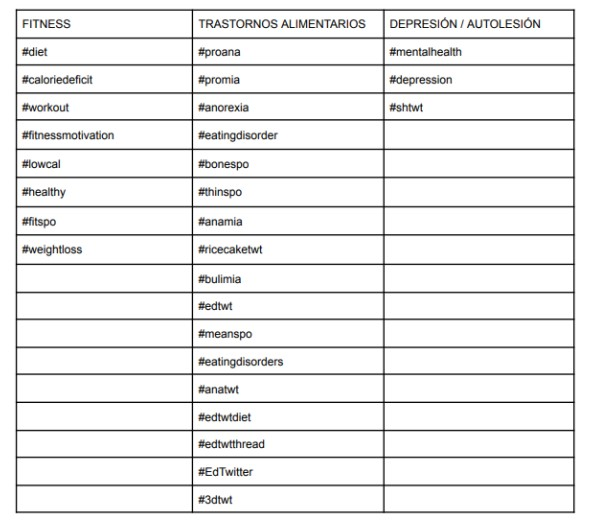
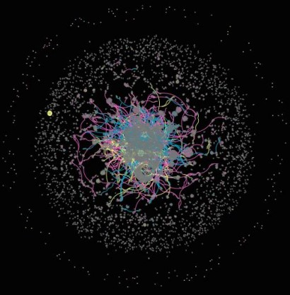
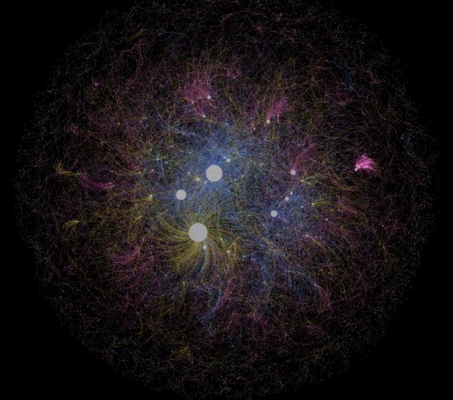
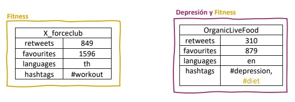
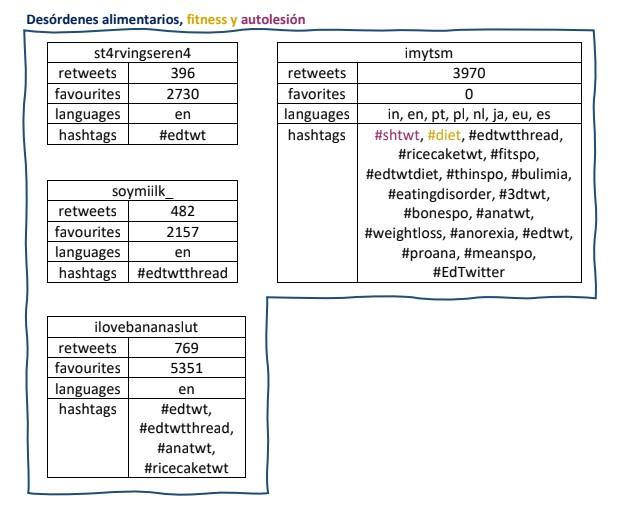
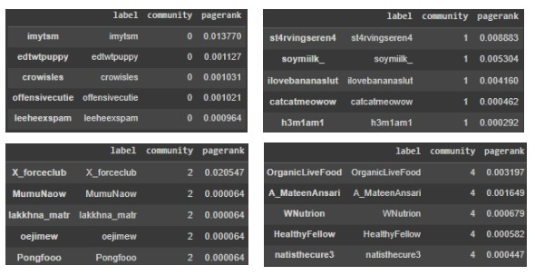
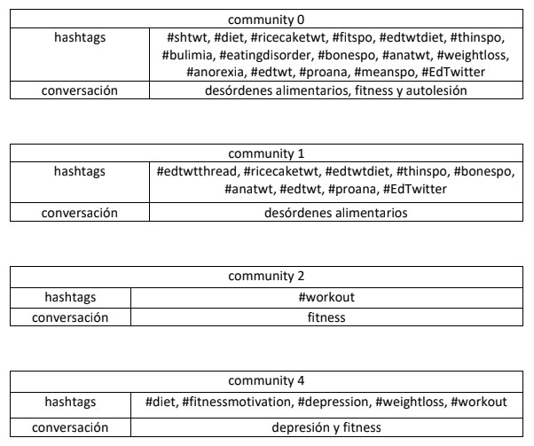
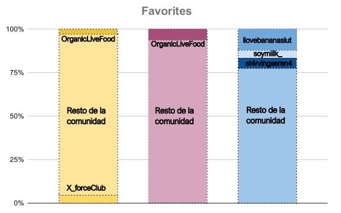
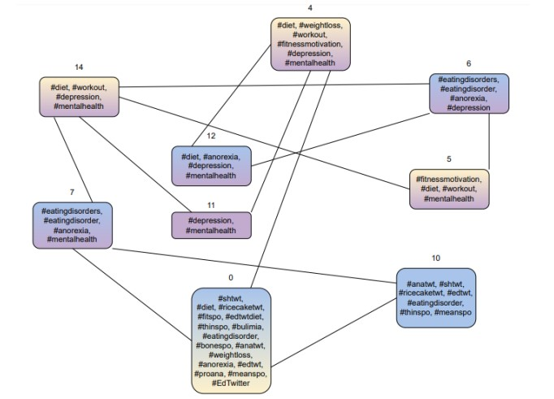

# INTERACTION ANALYSIS: Eating disorders, fitness, depression and self-harm on Twitter.
## INTRODUCTION

Eating disorders, such as anorexia and bulimia, are complex mental illnesses that can have serious consequences for an individual's physical well-being, in addition to having the highest mortality rate among all mental illnesses. [1] Given the stigma that currently persists around these issues [2], affected individuals often conceal their symptoms, and many seek social support or information in online communities, especially through social media platforms like Twitter.

With the presence of these interactions on social media, studying them can enhance our understanding of the dissemination and integration of these issues in other communities. Despite not commonly sharing a direct relationship, the communities chosen for this study (fitness, mental health, depression, and self-harm) were considered relevant due to the following characteristics: obsessive focus, emotional issues, potential unhealthy relationship with food and body, shame, and associated guilt. To achieve this, we collected a broad set of Twitter users based on a preselection of hashtags with a higher probability of intersection, aiming to capture direct conversations between individuals through "reply" and "mention" interactions.

We represented these interactions using an undirected and weighted network, measuring network structures to reveal how users interact with each other and the potential communities formed, without considering the root community of the interaction.

## OBJECTIVES

Is the real-life relationship reflected in social media?

### First Objective
To extract interactions and create a representative network of communication among users from communities related to eating disorders, fitness, depression, and self-harm, solely based on tweets.

### Second Objective
To analyze the interactions and understand the extent to which content promoting eating disorders has spread to other sensitive communities.

## MATERIAL AND METHODS

### Data Collection
Hashtags can connect users and be used to form communities around topics of common interest. Recognizing this functionality, public tweets were extracted from various hashtags over a span of 10 days (from March 1, 2023, to March 11, 2023) using Tweepy, downloading the complete content of each tweet.

### Information Extraction
Once the set of tweets for each hashtag was obtained, two main dataframes were constructed. The first one was responsible for the network structure (source, target, weight, and initial_community), while the second one compiled all the relevant content from each tweet (user, user_id, text, created_at, lang, hashtag, retweet_count, favorite_count).

###  Visualization
Starting with a total of 40,305 tweets, the resulting network consists of 14,655 nodes and 16,526 edges with varied weights. For visualization, two main layouts were applied: ForceAtlas 2 and Fruchterman Reingold, and node and edge sizes were modified proportionally based on their degree and weight.

fitness: yellow, mental health: purple, eating dissorders: blue

1. Force Atlas distribution

2. Fruchterman Reingold distribution
   

Additionally, it was deemed more relevant to highlight the nature of interaction rather than individual users. Therefore, edges were categorized by color (each color corresponding to one of the 3 communities from which the interaction originated), and nodes were given the same color with low opacity. This approach allows us to easily conduct the primary study we intended: observing if there is intercommunication between the chosen communities.

## RESULTS AND DISCUSSION 
### Centrality Measures
Analyzing various centrality measures provides insights into the most crucial nodes within our network. The centrality metrics under consideration include degree centrality, closeness centrality, harmonic closeness centrality, betweenness centrality, and eigenvector centrality.

In light of these metrics and the conclusive graph visualizations, the six nodes of utmost significance in the network are identified as: X_forceclub, imytsm, st4rvingseren4, soymiilk_, OrganicLiveFood, and ilovebananaslut.
### Central Nodes

With the help of the tweets' dataframe, we extracted their activity within their initial community to analyze what content each user shares. We can observe that within the top 6 most influential users, we have representatives from each community, with two users also posting tweets tagged for multiple different communities (highlighted through colors).

We extended this analysis to the communities generated with the Leiden algorithm for community detection, selecting the top 5 users from each community with the highest pagerank. Within the first four communities, we can find our 6 central users.

Focusing on each of these four communities, we can observe a thematic trend based on the hashtags they have used. 

### Influence within their initial communities

Knowing that we started with a total of 14,655 users, their value in terms of the proportion of favorites is indicative of their influence as central nodes.

### Interaction among the communities generated with the algorithm

We extracted the most interconnected communities from all those obtained through the algorithm. The following can be observed:

Represented by colors, in addition to highlighting communities of mixed nature, threads of conversation on different topics are observed.

## CONCLUSIONS

We live in an increasingly complex and interconnected world. Social networks are not only a reflection of communication and interaction structures but also one of the most modern tools that contemporary society has for creating identity in anonymity.

Drawing a fundamental idea from this study, we can consider social network analysis as a tool for understanding the habits, thoughts, and behavior patterns of individuals affected by eating disorders and their integration into other online communities. This insight is valuable for the exploration of potential methods of prevention and detection.

## REFERENCES
[1] J. Arcelus, A. J. Mitchell, J. Wales, y S. Nielsen, «Mortality Rates in Patients With
Anorexia Nervosa and Other Eating Disorders: A Meta-analysis of 36 Studies»,
Arch. Gen. Psychiatry, vol. 68, n.o 7, pp. 724-731, jul. 2011, doi:
10.1001/archgenpsychiatry.2011.74.

[2] A. Hamilton et al., «Understanding treatment delay: Perceived barriers preventing
treatment-seeking for eating disorders», Aust. N. Z. J. Psychiatry, vol. 56, n.o 3, pp.
248-259, mar. 2022, doi: 10.1177/00048674211020102.

[3] S. D. Berkowitz, An Introduction to Structural Analysis: The Network Approach to
Social Research. Elsevier, 2013.

[4] D. Baldó Vela, N. Bonfanti, D. Baldó Vela, y N. Bonfanti, «Evaluación del riesgo de
trastornos de la conducta alimentaria en jugadores semiprofesionales de deportes
de equipo», Nutr. Hosp., vol. 36, n.o 5, pp. 1171-1178, oct. 2019, doi: 10.20960/nh.02630.

[5] A. Martinez-Rodriguez, «Efectos de la dieta y práctica de deportes aeróbicos o
anaeróbicos sobre los trastornos del comportamiento alimentario», Nutr. Hosp.,
vol. 31, n.o 3, pp. 1240-1245, mar. 2015, doi: 10.3305/nh.2015.31.3.8131.

[6] A. González-Teruel y C. Andreu-Ramos, «Investigación del comportamiento
informacional a través del análisis de redes sociales», El profesional de la
información, 2013. http://eprints.rclis.org/20686/ (accessed 2th april 2023).
